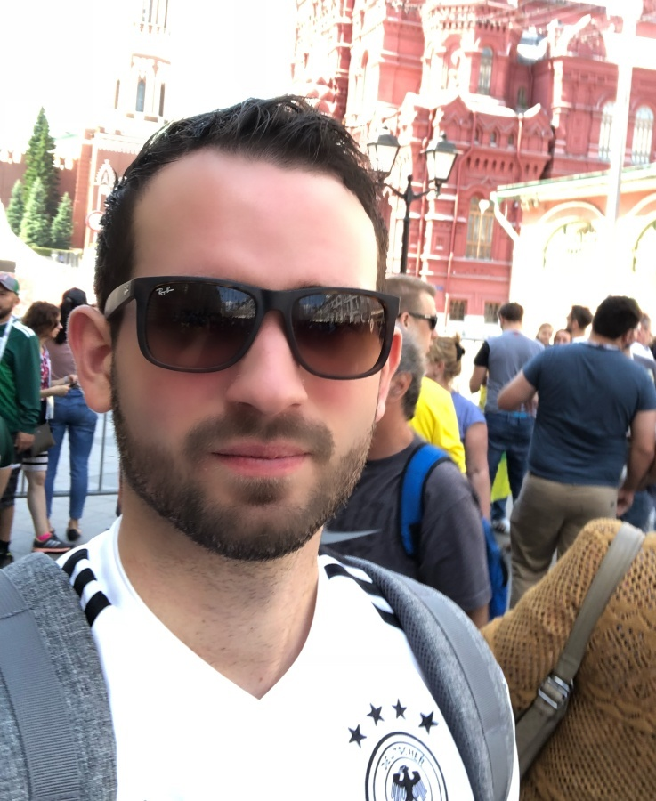

# RetinaGlass
Training and Evaluation service for detecting glasses on Face. 

- [Motivation](#motiv)
- [Repo Structure](#repo)
- [Pre-requisite](#prereq)
- [Model Training](#train)
- [Model Evaluation](#eval)
- [TO DO](#to-do)

<a name="motiv"></a>
## 1. Motivation

Objective: 
- The task here is to implement a classifier for images with a human face, separating them into people with glasses and everyone else. 
- It is assumed that the approach will be developed with an emphasis on its further use in a mobile application in real-time.

I found 2 approaches to complete this task:

Approach-1: 
- Train a Yolov7 model to detect glasses and 5 landmark key points on the face. 
- This repo: `https://github.com/derronqi/yolov7-face/tree/main` already has the training code to detect face along with 5 kpt. The accuracy and inference speed is also decent. 
- To modify this repo to the task in hand will not be much trouble -- We only have to replace the face bbox with glasses bbox. For this I would be using the MTFL dataset given here: `http://mmlab.ie.cuhk.edu.hk/projects/TCDCN.html`

I did not find the time to try this approach. I started with this, but somewhere my code was breaking when I was trying to modify the arch for glass detection. In the interest of time, I switched to approach-2.

Approach-2:
- On similar lines described in Approach-1 we can also train Retinaface model available here: https://github.com/biubug6/Pytorch_Retinaface/tree/master
- RetinaFace is specifically designed for face detection, while YOLOv7 is a more general object detection model. Generally, RetinaFace would be expected to provide better face detection performance since it is specifically optimized for this task.
- RetinaFace with a MobileNet backbone is lightweight and optimized for mobile and edge devices, making it fast and efficient. **The final model size is 1.7MB.** 
- For this approach also I would be using the MTFL dataset given here: `http://mmlab.ie.cuhk.edu.hk/projects/TCDCN.html`

<a name="repo"></a>
## 2. Repo Structure

The repo is organised as below:

```
RetinaGlass
  ├── Pytorch_Retinaface   
  |   ├── utils/            {scripts common across modules}
  |   ├── data/             {dataloader utility}
  |   ├── models/           {Retinaface arch implementation}
  |   ├── test_mtfl.py      {testing trained model on mtfl data}     
  |   └── train.py          {model training}
  ├── yolov7-face
  |   ├── models/           {yolov7 arch implementation}
  |   ├── test.py           {testing trained model on mtfl data}     
  |   └── train.py          {model training}
  ├── notebooks/
  ├── data   
  |   ├── MTFL/             {MTFL dataset}
  |   ├── sample_test/      {sample test provided by team}
  ├── Dockerfile
  ├── Makefile
  ├── requirements.txt
  |  
```

<a name="setup"></a>
## 3. Evnironment Setup

The entire application is containerised. One can launch just 2 Makefile commands to get started with training:

```bash
make dbuild drun
```

<a name="train"></a>
## 4. Model Training
To start training one can set a proper experiment name under `EXP` under `train` target in Makefile and start training by calling `make train` from inside the docker. 

To train the original Retinaface model for glass detection on MTFL dataset I made below changes: 
1. I added a new dataloader for MTFL dataset. 
2. Configured the number of classes in cfg to be 2: [glasses and no-glasses]
3. Modified train.py to work with MTFL kind of data. 
4. Modified dataloader to define glass bbox around left-eye keypoint and right-eye keypoint with some padding. 
 
Config value used for training are present here:
- [config.py](./Pytorch_Retinaface/data/config.py)

The config is called inside [train.py](./Pytorch_Retinaface/train.py) script used as entry point for model training. 

Import parameters in `make train` to note for model training:
- `training_dataset` : Location of dataset to be used for training. 
- `network` : backbone that has to be used for RetinaFace model. 
- `resume_net` : Path to pretrained checkpoint. 
- `save_folder` : location where final checkpoints will be saved. 

I have also added log file from one of my trainings [here](train-retinaglass_mobile0.25_pad20-mtfl.out). We see that all losses are continuously decreasing showing good learning power for the model.

<a name="eval"></a>
## 5. Model Evaluation
To evaluate the model on MTFL dataset I have written a custom function [test_mtfl.py](./Pytorch_Retinaface/test_mtfl.py) 
For other dataset types, specific functions have to be written. 

## 6. Sample results

Sample result on 40 images shared by the team is attached in `results` folder. We see the trained model having 1.7MB in size is doing well for this task: 

True Positive:
<div style="text-align: left"></div>
<br>

<div style="text-align: left"></div>
<br>

<div style="text-align: left"></div>
<br>

<div style="text-align: left"></div>
<br>

<div style="text-align: left"></div>
<br>

<div style="text-align: left"></div>
<br>

<div style="text-align: left"></div>
<br>

<div style="text-align: left"></div>
<br>

True Negatives:
<div style="text-align: left"></div>
<br>

<div style="text-align: left"></div>
<br>

False Positives: 
None

False Negative:
<div style="text-align: left"></div>
<br>

<div style="text-align: left"></div>
<br>


<a name="to-do"></a>
## 6. To-Do
- [x] Setup initial training RetinaFace + MLTK dataset.  
- [x] Add Makefile, Docker, requirements.txt
- [ ] Add Pre-Hook Commit for Notebooks. 
- [x] Update README 
- [ ] End-phase bug fix.
- [x] Test `make train`
- [x] Test `make test-sample`
- [ ] 
- [ ] 